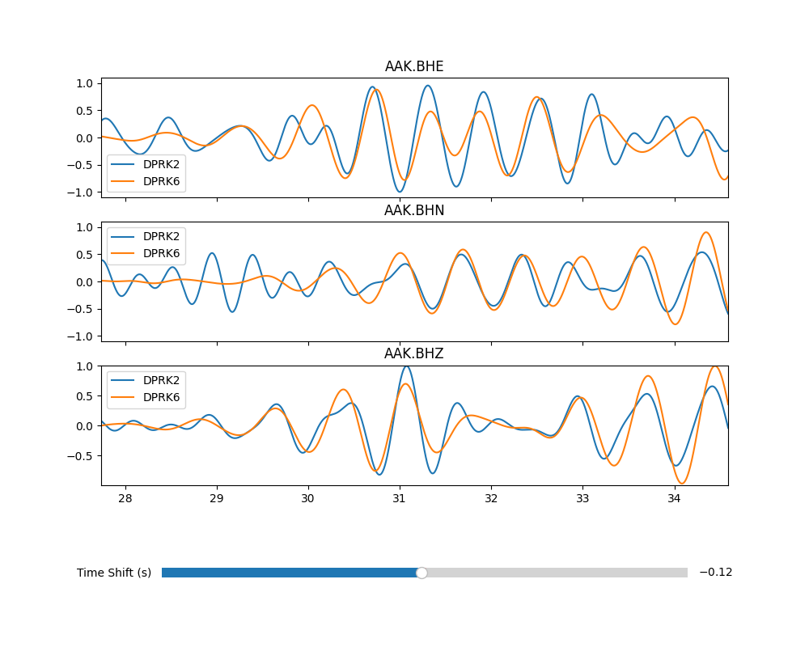

# wa_slider
A python program that reads seismic waveforms from two events and allows the user to slide one over the other, picking a reference time  

Version 1.0.0 of wa_slider is permanently archived on Zenodo at https://doi.org/10.5281/zenodo.18301929 

[](https://doi.org/10.5281/zenodo.18301929)  

[](https://api.eu.badgr.io/public/assertions/bhluJFrxTty2Twhzer-h8w "SQAaaS bronze badge achieved")  
[](https://api.eu.badgr.io/public/assertions/bhluJFrxTty2Twhzer-h8w "SQAaaS bronze badge achieved")  

This is purely a development code and has yet to be seriously tested or applied to any documented study.  

# Example  

Executing the lines
```
#!/bin/sh
f1=1.2
f2=2.5
ev1=DPRK2
ev2=DPRK6
station=AAK
phase=P
outfile=${station}_${phase}_dt.txt
topdir=../SACwf
python wa_slider.py --f1 ${f1} --f2 ${f2} \
                    --ev1 ${ev1} --ev2 ${ev2} \
                    --station ${station} \
                    --topdir ${topdir} \
                    --phase ${phase} \
                    --outfile ${outfile} \
                    --chan1 AAK.BHZ --chan2 AAK.BHN --chan3 AAK.BHE
```
will generate the display shown given the presence of the files
```
AAK.DPRK2/AAK.BHE.sac  AAK.DPRK2/AAK.BHN.sac  AAK.DPRK2/AAK.BHZ.sac
AAK.DPRK6/AAK.BHE.sac  AAK.DPRK6/AAK.BHN.sac  AAK.DPRK6/AAK.BHZ.sac
```
under the directory *topdir* where each of these sac files is approximately centered on the signal of interest.  

!
